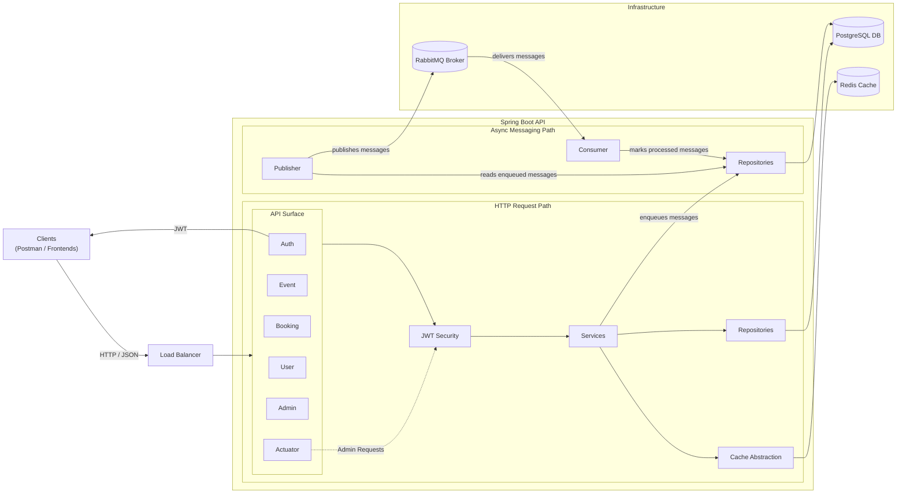

# Booking Service


A Spring Boot 3 service for users to book tickets to events, as well as create and manage their own.

This is an enterprise-grade codebase aligned with industry best practices, demonstrating expertise in backend engineering and infrastructure.

### ℹ️ Overview
Booking Service allows users to:
- Register and authenticate via JWT (JSON Web Token)
- Create, manage and view Events
- Create and view Ticket Types for Events, including capacity
- Create and view Bookings for Tickets, including oversell protection
- Manage and view their profile (E.g. Update handle)
- Perform Admin operations (E.g. Update User role)
- View service metrics

#### ⚙️ Tech Stack
- Java 17+
- Spring Boot 3
- Spring Boot Actuator
- Spring Security
- PostgreSQL
- Redis
- RabbitMQ
- Docker
- JUnit 5 & Mockito
- Testcontainers (Integration testing)

#### 🧩 Application Architecture
Core functionality organised across layers:

`Controller → Service → Repository`

- Controllers handle HTTP requests and DTO (Data Transfer Object) mapping
- Services handle business logic
- Repositories handle persistence logic

Supporting infrastructure:
- PostgreSQL for storing transactional data
- Redis for cache-backed reads
- RabbitMQ for asynchronous follow-up processing

Clear separation of API (Interface), Domain (Core business logic) and Infrastructure.
Improves testability, scalability and flexibility.

#### 🏗️ System Architecture
Envisaged as part of a wider system, including:
* Load balancer/s paired with stateless API design, enabling horizontal scaling
* Separate infrastructure layer, protecting business logic from data-access details



#### 🗂️ Domain Modelling
Key Entities:

- User
- Event
- TicketType
- Booking
- BookingItem

Design Principles:

- Explicit aggregates (e.g. Booking contains multiple BookingItems, which are accessed through that Booking and follow common rules)
- UUID-based identities
- Domain Models (Business logic) separate from DTOs (API contract)
- Public vs Internal identity separation

#### 👥 Public vs Internal Identity
Distinguishes between:

| Type | Field | Purpose                                 
|------|-------|---------
| Display | `displayName` | UI-friendly name
| Public | `handle` | Stable external identifier
| Internal | `id` | Database relations

For example, Event responses expose:

```json
{
  ...
  "organizer": {
    "displayName": "Dylan Rafferty",
    "handle": "dylan-rafferty"
  }
}
```

Internal IDs are not exposed publicly.

#### 🔐 Authentication & Authorization
- JWT-based authentication
- Stateless security (Any server can handle any request)
- Role-based access control via Spring Security

Roles:
- `USER`
- `ADMIN`

For example, `PATCH /admin/users/{id}/role` has:

```java
@PreAuthorize("hasRole('ADMIN')")
```

Only `ADMIN`s can change the role of another User.

#### 💾 Caching
Redis is used as a read-through cache for public, read-heavy endpoints where stale data is acceptable for a short period.

Current usage:
| Endpoint | TTL (Time To Live)                               
|----------|-------------------
| `GET /events` | 45 seconds
| `GET /events/:id` | 5 minutes

Strategy:
- Cache stable, shared reads with high re-use
- Do not cache Booking writes
- Do not cache paths that expose tickets' `capacityRemaining`
- Invalidate cache upon Event Update, Publish or Cancel
- If Redis unavailable, requests fall through to PostgreSQL

#### ✉️ Messaging
RabbitMQ is used for asynchronous follow-up work after a booking is confirmed. The flow is:

1. `POST /bookings` saves a booking to PostgreSQL
2. A `booking.confirmed.v1` message is saved in the same transaction
3. `OutboxEventPublisher` detects the message and sends it to RabbitMQ
4. RabbitMQ directs the message to a queue (`booking.notification.booking-confirmed.v1`)
4. `BookingConfirmationListener` detects the queued message and saves a dispatch to the DB (Placeholder behaviour for e.g. Sending an e-mail)

The Outbox pattern (saving message-related info the DB) is utilised:
- Avoids dual-write issues between PostgreSQL and RabbitMQ
- Ensures messages are only published after booking transactions succeed
- Message publish failures can retry without losing booking info

#### 🔎 Observability
Spring Actuator is used for exposing service metrics.

Strategy:
- `/health` and `/info` data is public for operational checks
- `/metrics` and `/prometheus` data is Admin-only for metrics collection
- `correlationId` ties responses, logs and errors to requests (Explicitly provided via `X-Correlation-ID` header)
- Redis and RabbitMQ will only be considered by `/health` when enabled

#### 💪 Resilience
Measures are used to address failure scenarios.

Strategy:
- `POST /bookings` correctness is handled through database constraints, atomic capacity updates and idempotency
- `POST /bookings` also stores `request_fingerprint` to prevent `Idempotency-Key` header reuse with different bookings
- RabbitMQ consumer retries are limited, with a short backoff for data-access failures. Failed messages go to the dead-letter queue
- High-risk endpoints are protected by an in-memory rate limiter:

| Endpoint | Purpose |
|----------|---------|
| `POST /auth/login` | Reduce brute-force/login spam risk |
| `POST /auth/register` | Reduce account creation bursts |
| `POST /bookings` | Protect contention-heavy booking writes |

To address these problems at scale, rate limiting would move to Redis, an API gateway or edge infrastructure.

#### ✨ Other Features
1. **Oversell Protection (Concurrency-Safe)**
    Ticket booking uses atomic database updates:

    ```sql
    UPDATE TicketType ticketType
    SET ticketType.capacityRemaining = ticketType.capacityRemaining - :qty
    WHERE ticketType.id = :ticketTypeId and ticketType.capacityRemaining >= :qty
    ```

    Also validates quantities and reserves Ticket Types in consistent order, reducing deadlock risk when concurrent requests contain the same items in different orders.

    * No overselling
    * Safety under high concurrency
    * Enforcement at DB level

2. **N+1 Query Avoidance**
    Bulk-fetch strategy is used to avoid chain-reactions of queries.

    For example:
    * `GET /events` - All organizers are retrieved in 1 call.
    * `GET /bookings/mine` - All Booking Items are retrieved in 1 call.

    Prevents performance degradation at scale.

3. **Global Error Handling**
    Central handling via `@RestControllerAdvice`, producing consistent API responses:

    ```json
    {
      "timestamp": "...", 
      "status": 401,
      "error": "UNAUTHORIZED",
      "message": "...",
      "path": "...",
      "correlationId": "...",
      "details": null
    }
    ```

4. **Pagination**
    List endpoints (e.g. `GET /events`) support pagination:

    ```
    ?page=0&size=20
    ```

    Ensures scalability with large datasets.

#### 🧪 Testing
* **Unit:** Verifies business logic in isolation using JUnit and Mockito.
* **Framework Integration:** Verifies Spring-managed behaviour (e.g. caching, messaging) using lightweight Spring test context with mocked repositories.
* **Infrastructure Integration:** Verifies persistence and concurrency behaviour against PostgreSQL using `@Testcontainers`.

---

### 🔌Endpoints
#### Authentication
| Route | Description                                     
|-------|-------------
| <kbd>POST /auth/register</kbd> | Register new User
| <kbd>POST /auth/login</kbd> | Authenticate User via JSON Web Token (JWT)

#### Events
| Route | Description                                          
|-------|-------------
| <kbd>POST /events</kbd> | Register new Event
| <kbd>PATCH /events/:id</kbd> | Update specific Event
| <kbd>POST /events/:id/publish</kbd> | Publish specific Event
| <kbd>POST /events/:id/cancel</kbd> | Cancel specific Event
| <kbd>GET /events</kbd> | List Published upcoming Events (Pageable via `?page=x&size=y`)
| <kbd>GET /events/mine</kbd> | List User's Draft & Published Events (Pageable via `?page=x&size=y`)
| <kbd>GET /events/:id</kbd> | Get specific Event
| <kbd>POST /events/:id/ticket-types</kbd> | Register new Ticket Type for specific Event
| <kbd>GET /events/:id/ticket-types</kbd> | List Ticket Types for specific Event

#### Bookings
| Route | Description                                          
|-------|-------------
| <kbd>POST /bookings</kbd> | Register new Booking(s)
| <kbd>GET /bookings/mine</kbd> | List User's Bookings (Pageable via `?page=x&size=y`)

#### Users
| Route | Description                                          
|-------|-------------
| <kbd>PATCH /users/me</kbd> | Update current User details
| <kbd>GET /users/me</kbd> | Get current User

#### Admin
| Route | Description                              
|-------|-------------
| <kbd>PATCH /admin/users/:id/role</kbd> | Update specific User's role

#### Actuator
| Route | Description                                          
|-------|-------------
| <kbd>GET /actuator/health</kbd> | Get whether service and infrastructure are working overall
| <kbd>GET /actuator/health/liveness</kbd> | Get whether service is in a valid state
| <kbd>GET /actuator/health/readiness</kbd> | Get whether service can handle requests
| <kbd>GET /actuator/info</kbd> | Get service metadata
| <kbd>GET /actuator/metrics</kbd> | List runtime metrics (Admin-only, queryable via `/<metric name`>)
| <kbd>GET /actuator/prometheus</kbd> | List runtime metrics for Prometheus tools (Admin-only)

---

### 🛠️Setup

#### Getting Started
1. Clone the repository:

    ```bash
    git clone https://github.com/draff1800/booking-service.git
    cd user-service
    ```

2. Set up `.env` environment variables:
    - Create a `.env`:

      ```bash
      cp .env.example .env
      ```

    - Adjust its values based on your desired configuration:

      - `RATE_LIMIT_ENABLED`: Whether request limiting is enabled (e.g. in `POST /auth/login`)
      - `RATE_LIMIT_CAPACITY`: Request limit per `RATE_LIMIT_REFILL_PERIOD_S`
      - `RATE_LIMIT_REFILL_PERIOD_S`: Duration before request limit resets
      - `JWT_SECRET`: String for authorization
      - `JWT_TIME_TO_LIVE_S`: Seconds the JWT is valid for
      - `POSTGRES_HOST`: Database host (e.g. `localhost`)
      - `POSTGRES_PORT`: Database port (e.g. `5432`)
      - `POSTGRES_DB`: Database name
      - `POSTGRES_USER`: Database User username
      - `POSTGRES_PASSWORD`: Database User password
      - `REDIS_ENABLED`: Whether caching is enabled (e.g. in `GET /events`)
      - `REDIS_HOST`: Cache host (e.g. `localhost`)
      - `REDIS_PORT`: Cache port (e.g. `6379`)
      - `RABBITMQ_ENABLED`: Whether messaging is enabled (e.g. in `POST /bookings`)
      - `RABBITMQ_HOST`: Broker host (e.g. `localhost`)
      - `RABBITMQ_PORT`: Broker port (e.g. `5672`)
      - `RABBITMQ_USER`: Broker User username (e.g. `guest`)
      - `RABBITMQ_PASSWORD`: Broker User password (e.g. `guest`)
      - `RABBITMQ_OUTBOX_PUBLISH_DELAY_MS`: How often unpublished messages are published
			
3. Load `.env` for use by `application.properties`:

    ```bash
    set -a
    source .env
    set +a
	  ```

#### Local Development
1. Install the following prerequisites:
    - Java 17
    - Docker Desktop

2. Run Docker Desktop

3. Run the infrastructure layer (DB, Cache and Broker)

    ```bash
    docker compose up -d
    ```

4. Run the service (on [localhost:8080](http://localhost:8080)):

    ```bash
    ./gradlew bootRun
    ```

5. To bootstrap a first Admin:
    * Register a User via `/auth/register`
    * Run `docker ps` to find the database container name
    * Open a psql session in the container:
        ```bash
        docker exec -it <container name> psql -U <POSTGRES_USER value> -d <POSTGRES_DB value>
        ```
    * Run the following SQL:
        ```sql
        UPDATE users 
        SET role = 'ADMIN' 
        WHERE email = <users email>;
        ```
    * Log in via `auth/login` to receive updated JWT with `ADMIN` role

6. A [Postman collection](docs/postman/booking-service.postman_collection) is included for manual testing

7. When stopping the service, remember to stop the infrastructure too:

    ```bash
    docker compose down
    ```

---

### 🌱 Future Improvements
* OpenAPI integration (API documentation)
* Automated code quality checks
* General functionality additions
* Improved test coverage
* Distributed rate limiting
